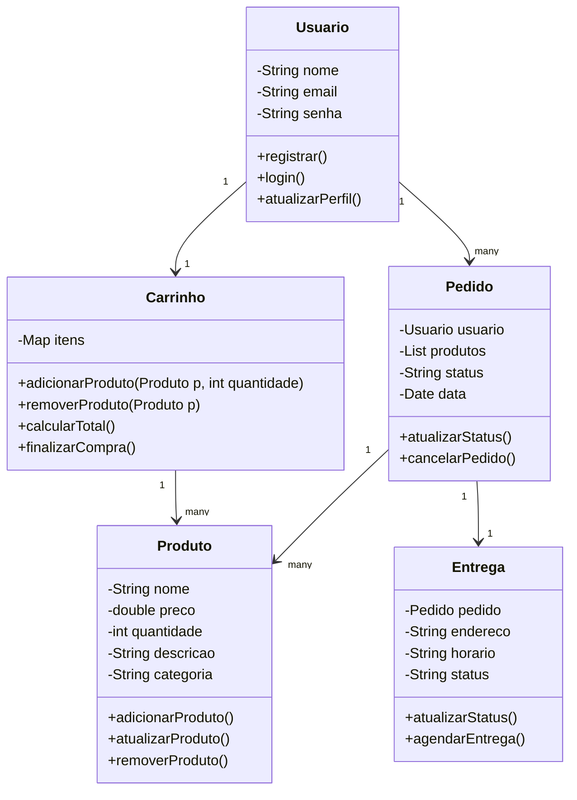
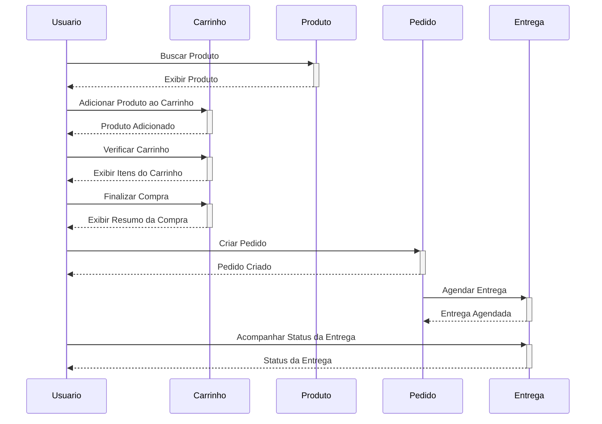

# Planejamento do Projeto: Aplicativo de Supermercado

## Seção 1 - Introdução

### Justificativa
Com o avanço da tecnologia e a crescente adoção de dispositivos móveis, o comportamento dos consumidores tem mudado significativamente. Cada vez mais pessoas buscam soluções práticas e rápidas para suas necessidades diárias, incluindo a compra de produtos de supermercado. A pandemia de COVID-19 também acelerou essa tendência, destacando a importância de serviços de entrega eficientes e de qualidade.

### Descrição do Problema
Os consumidores enfrentam diversos desafios ao fazer compras em supermercados, como filas longas, falta de produtos, dificuldade em encontrar ofertas e promoções, além da necessidade de carregar compras pesadas. Para os supermercados, a gestão eficiente do estoque, a fidelização de clientes e a competição com grandes redes de varejo são problemas constantes.

### Motivação
A criação de um aplicativo que simplifique o processo de compra e entrega de produtos de supermercado pode solucionar muitos desses problemas. Um aplicativo eficiente pode melhorar a experiência do usuário, aumentar a conveniência, economizar tempo e proporcionar um serviço de entrega rápido e confiável. Além disso, pode ajudar os supermercados a gerenciar melhor seu estoque e oferecer promoções personalizadas, aumentando a satisfação e a fidelização dos clientes.

## Seção 2 - Plano

### Objetivo Geral
Desenvolver um aplicativo de supermercado que facilite o processo de compra e entrega de produtos, proporcionando uma experiência de usuário intuitiva e eficiente, com foco na conveniência e satisfação do cliente.

### Objetivos Específicos
1. **Facilidade de Uso**
   - Criar uma interface amigável e intuitiva, que permita aos usuários navegar facilmente pelo aplicativo e encontrar os produtos desejados com rapidez.
   
2. **Funcionalidades de Pesquisa e Filtro**
   - Implementar funcionalidades de pesquisa e filtros que permitam aos usuários encontrar produtos específicos, ofertas e promoções com facilidade.
   
3. **Carrinho de Compras e Pagamento**
   - Desenvolver um sistema de carrinho de compras eficiente e métodos de pagamento seguros, incluindo opções de pagamento digital como cartões de crédito, débito e carteiras virtuais.
   
4. **Gestão de Entregas**
   - Criar um sistema de gestão de entregas que permita aos usuários acompanhar o horários de entrega convenientes e o status de suas encomendas em tempo real.

5. **Gestão de Estoque**
   - Desenvolver ferramentas de gestão de estoque para ajudar os supermercados a monitorar a disponibilidade de produtos e evitar rupturas de estoque.

### Metodologia
Para atingir esses objetivos, a equipe de desenvolvimento seguirá uma metodologia ágil, dividida nas seguintes fases:
- **Planejamento e Pesquisa**
  - Coleta de requisitos, análise de mercado e estudo de concorrentes.
- **Design e Prototipagem**
  - Criação de wireframes, design da interface do usuário e protótipos interativos.
- **Desenvolvimento**
  - Implementação das funcionalidades planejadas, testes contínuos e ajustes conforme necessário.
- **Lançamento e Marketing**
  - Preparação para o lançamento do aplicativo, estratégias de marketing e campanhas de divulgação.
- **Manutenção e Atualizações**
  - Monitoramento do desempenho do aplicativo, coleta de feedback dos usuários e lançamento de atualizações para melhorias contínuas.

## Seção 3 - Equipe

- **Asaphe N. R. O. Braz**
- **Daniel Kenji Tomo Watanabe**
- **Thales Jaime Nascimento De Paula**
- **Yuri Cassiano Matsuoka**

## Seção 4 - Modelagem Inicial

### Diagrama de Classes

### Diagrama de Sequência: Fluxo de Compra

### Casos de Uso
#### Cadastro de Usuário
1. **Principal:** Usuário
2. **Objetivo:** Registrar um novo usuário no sistema.
3. **Como Funciona:**
   - O usuário acessa a tela de cadastro.
   - O usuário insere suas informações (nome, email, senha).
   - O sistema valida as informações.
   - O sistema registra o usuário e exibe uma mensagem de sucesso.

#### Compra de Produto
1. **Principal:** Usuário
2. **Objetivo:** Realizar a compra de produtos.
3. **Como Funciona:**
   - O usuário busca produtos.
   - O usuário adiciona produtos ao carrinho.
   - O usuário visualiza o carrinho.
   - O usuário finaliza a compra.
   - O sistema cria um pedido e confirma a compra.
